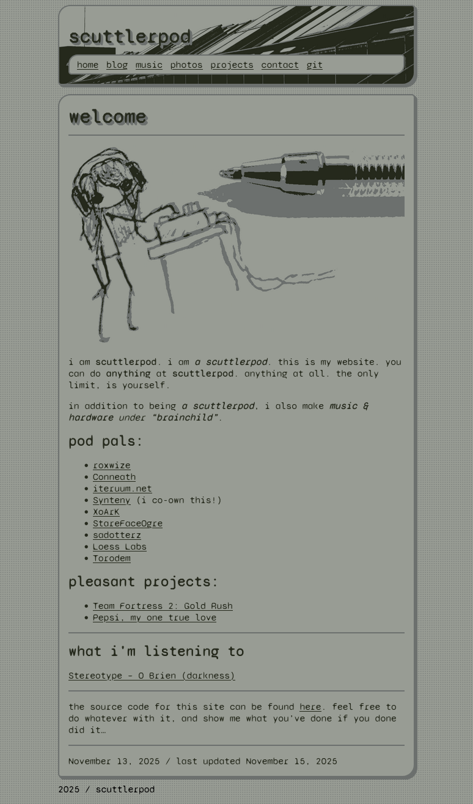
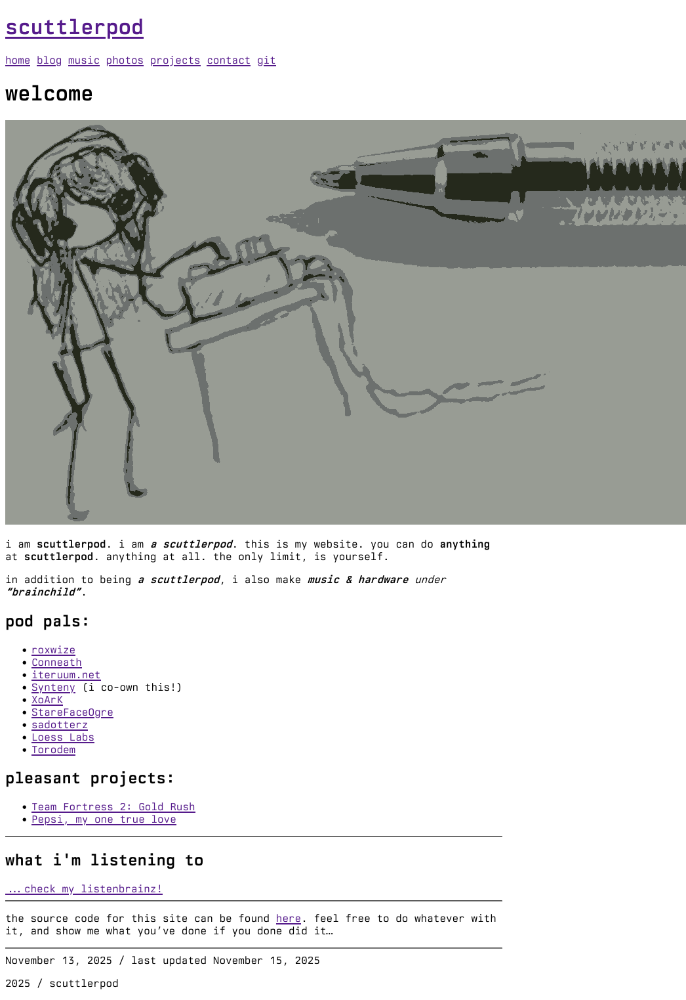

# scuttlerpod website
this is the soruce code for my personal website, written in Hugo.

## features:
- stylized minimal css theme, inspired by LCD displays
- index page shows my current/last track on ListenBrainz
- plays well with both mobile and desktop devices
- automatic section/post categorization based on file structure
- post tagging, and the ability to browse posts under a specific tag
- some nice graphics, derived from my own photos/artwork
- completely usable without JS, or even CSS!
- RSS feed generation
- website.

